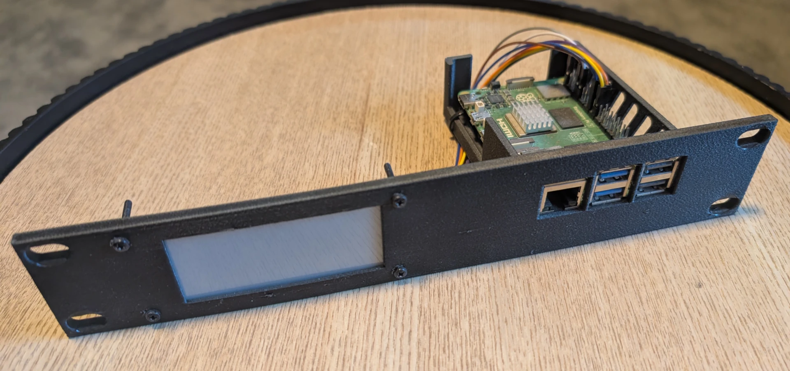
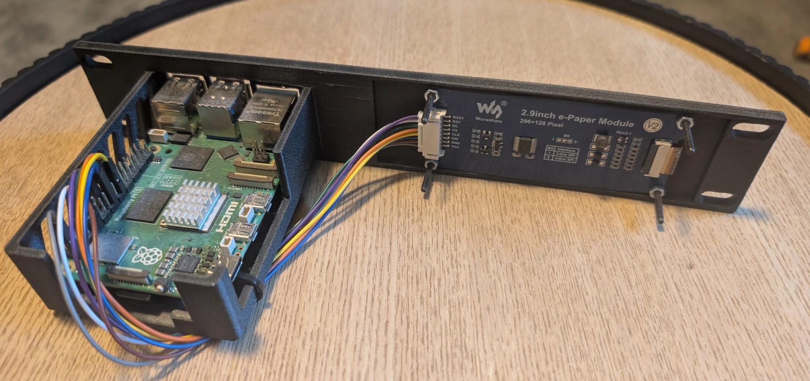

# nova-eink-display

[](https://docs.renovatebot.com/)

[](https://github.com/Zireaell1/nova-eink-display/blob/main/LICENSE)
[](https://github.com/Zireaell1/nova-eink-display/commits/main/)
[](https://github.com/Zireaell1/nova-eink-display/actions)

> [!WARNING]
> **Work in progress**
> The core functionality is quite stable, but some planned features and a standalone executable are still in development.


Hi! This is a repository containing a script for a Waveshare E-ink display that I use in my [homelab](https://github.com/Zireaell1/nova-homelab). It shows different system stats, like CPU and memory usage.

To make it more interesting, I added a character that reacts depending on the readings and other factors. For example, it will sleep at night or panic when the server is running on a UPS and the battery is low.

### Features
Aside from displaying stats and the character, the script includes:
* **Prometheus Integration:** Exposes an endpoint for metrics like screen wear counters and character mood monitoring.
* **Live Preview:** Exposes an endpoint to view the image currently displayed on the screen.
* **Persistent State:** Saves the screen wear state to a file so it persists across restarts.
* **Smart Scheduling:** Configurable fetch intervals, partial/full refresh ratios, and "asleep" hours when the screen goes into a power-off state displaying a specific static frame.

This script was built for my own setup, but if you would like to use it, feel free to download and adapt it! Everything is configurable through a `.env` file (see `.env.example` for a fully commented setup).

## Hardware

I am running this on a Raspberry Pi 5 (8GB) connected to a [Waveshare 2.9" e-Paper Module (V2)](https://www.waveshare.com/wiki/2.9inch_e-Paper_Module).

Honestly, a Pi 5 is absolute overkill for this script. I just used it because it was what I already had before I started this project.

The screen and Pi are mounted in my server rack using a custom 3D-printed case, printed in [Fiberlogy PETG CF](https://fiberlogy.com/en/PETGCF-Filament-1_75mm-0_85kg). Part of the case design was adapted from an existing model (see Credits).

### Wiring & Pinout
If you are wiring the screen manually, refer to the official pinout guides:
* [Waveshare 2.9" e-Paper Module Raspberry Pi Connection Guide](https://www.waveshare.com/wiki/2.9inch_e-Paper_Module_Manual#Working_With_Raspberry_Pi)
* [Raspberry Pi 5 GPIO Pinout Documentation](https://www.raspberrypi.com/documentation/computers/raspberry-pi.html#gpio)

## Installation / Development Setup

*Note: A standalone executable is still a work in progress. For now, you can run it from the source code.*

### Prerequisites

1. **Package Manager:**
   * [uv](https://docs.astral.sh/uv/) installed on your system.

2. **Raspberry Pi OS Configuration (if running on hardware):**
   * **Enable SPI:** Run `sudo raspi-config` → **Interface Options** → **SPI** → **Yes**, then reboot.
   * **System Dependencies:** Install the required native libraries and build headers:
     ```bash
     sudo apt update && sudo apt install -y swig liblgpio-dev python3-dev python3-packaging
     ```
   *(Note: You can run and test this on your local machine without a screen or SPI by setting `SIMULATE=true` in your `.env` file).*

### Manual Setup & Run

1. Clone the repository and navigate into the folder:
```bash
git clone https://github.com/Zireaell1/nova-eink-display.git
cd nova-eink-display
```

2. Set up your environment file:
```bash
cp .env.example .env
# Edit .env with your specific settings (Prometheus URL, intervals, etc.)
```

3. Install dependencies and run the script:
```bash
uv sync
uv run nova-eink-display
```

### Automation via Ansible

If you manage your homelab via Ansible, you can automate the system setup and run the display as a background `systemd` service using these roles from [nova-homelab](https://github.com/Zireaell1/nova-homelab):

* [`rpi_base`](https://github.com/Zireaell1/nova-homelab/tree/main/ansible/roles/rpi_base) – Configures base packages and enables the hardware SPI interface.
* [`eink_display`](https://github.com/Zireaell1/nova-homelab/tree/main/ansible/roles/eink_display) – Installs, configures, and manages the e-ink display service.

## Tests

The repository includes `pytest` tests for the exposed endpoints and the wear state file.

You can execute them directly from the terminal:

```bash
uv run pytest
```

If you are using the provided VS Code workspace, you can also run them easily via the configured VS Code task or built-in tab.

## Credits

* `src/nova_eink_display/lib/` is Waveshare's driver from [waveshareteam/e-Paper](https://github.com/waveshareteam/e-Paper), refactored but under its original MIT licence.
* `assets/fonts/slkscr.ttf` is [Silkscreen](https://github.com/googlefonts/silkscreen) by Jason Kottke, SIL Open Font License 1.1. The licence travels with it in `assets/fonts/OFL.txt`.
* Part of the 3D-printed case design was adapted from [Raspberry Pi 5 Rack mount on Printables](https://www.printables.com/model/781167-raspberry-pi-5-rack-mount).

## Images

Here is the physical build of the display and the custom Fiberlogy PETG CF case. *(Note: The screen is powered off in these photos to show the hardware assembly).*

**Front view:**


**Back view:**


> [!NOTE]
> The character images I use in my personal setup were AI-generated, then scaled and edited by me. Because I don't want to just push "AI slop" to the repo, I haven't included them by default. However, I don't mind sharing them if someone would like to use them anyway! Just open an issue and ask. :)

*Work in progress*
